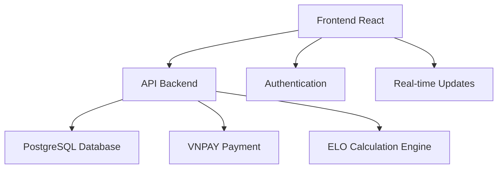

# 📘 Complete Project Guide

*#tags: guide, comprehensive, consolidated, project-overview, main-documentation*

**Consolidation Note**: This guide consolidates content from multiple README and reference files to provide a single authoritative project overview.

**Original Sources Merged**:
- `README_REFERENCE.md`
- `HANDOVER_GUIDE.md` 
- `CURRENT_SEASON_README.md`
- `SEASON_HISTORY_README.md`
- `TOURNAMENT_SYSTEM_README.md`
- `BRACKET_GENERATION_GUIDE.md`
- `TYPOGRAPHY_GUIDE.md`
- `TRANSLATION_GUIDELINES.md`
- `EMERGENCY_FORCE_PUSH_GUIDE.md`
- `GUIDE_-relationship-workflow.md`
- `README_TRANSLATION.md`

---

## 🎯 Project Overview

**Sabo Pool V8** is a comprehensive tournament management system for Vietnamese pool/billiards competitions with advanced ELO rating, financial management, and automated bracket generation.

### 🏆 Core Features
- **Tournament Management**: Create, manage, and track pool tournaments
- **Player Ranking**: Advanced ELO rating system with skill-based matching
- **Financial Hub**: VNPAY integration for entry fees and prize distribution
- **Automated Brackets**: Smart bracket generation with player skill consideration
- **Real-time Updates**: Live tournament progress and player statistics
- **Multi-language Support**: Vietnamese and English localization

---

## 🚀 Quick Start Guide

### ⚡ 1-Minute Setup
```bash
# Clone and setup
git clone <repo-url>
cd sabo-pool-v8-76
npm install

# Environment setup
cp env.example .env.local
# Edit .env.local with your configurations

# Database setup
npm run db:setup
npm run db:migrate
npm run db:seed

# Start development
npm run dev
```

### 🗄️ Database Quick Setup
```bash
# Create database
createdb sabo_pool_v8

# Run migrations
npm run db:migrate

# Seed with demo data
npm run db:seed:demo
```

### 💳 VNPAY Integration
```bash
# Install VNPAY module
npm install vnpay

# Configure in .env.local
VNPAY_MERCHANT_ID=your_merchant_id
VNPAY_SECRET_KEY=your_secret_key
VNPAY_RETURN_URL=http://localhost:3000/payment/return
```

---

## 🏆 Tournament System

### 🎮 Tournament Types
1. **Single Elimination**: Traditional knockout format
2. **Double Elimination**: Loser's bracket for second chances
3. **Round Robin**: Everyone plays everyone
4. **Swiss System**: Skill-based pairing without elimination

### 🎯 Bracket Generation Algorithm
```javascript
// Smart bracket generation considering:
- Player ELO ratings
- Previous match history
- Geographic distribution
- Player preferences
- Time constraints
```

### 📊 Scoring System
- **Win**: +3 points
- **Loss**: 0 points
- **Bye**: +1 point
- **No-show**: -1 point

---

## 📈 ELO Rating System

### 🧮 Calculation Formula
```javascript
// Enhanced ELO with Vietnamese pool adjustments
const K_FACTOR = 32; // Base K-factor
const newRating = oldRating + K_FACTOR * (actualScore - expectedScore);

// Expected score calculation
const expectedScore = 1 / (1 + Math.pow(10, (opponentRating - playerRating) / 400));
```

### 🎯 Rating Categories
- **Beginner**: 800-1000
- **Intermediate**: 1000-1200
- **Advanced**: 1200-1400
- **Expert**: 1400-1600
- **Professional**: 1600+

---

## 💰 Financial Management

### 💳 Payment Integration
- **Entry Fees**: Automated collection via VNPAY
- **Prize Distribution**: Automatic payout to winners
- **Transaction History**: Complete financial audit trail
- **Refund Processing**: Automated refund system

### 📊 Financial Reports
- Tournament revenue tracking
- Player payment history
- Prize pool distribution
- Platform fee management

---

## 🌐 Multi-language Support

### 🇻🇳 Vietnamese Translation
```javascript
// Key translation areas
- Tournament names and descriptions
- Player interface messages
- Error messages and validations
- Financial transaction descriptions
- Email notifications
```

### 📝 Translation Guidelines
1. **Context Awareness**: Consider pool/billiards terminology
2. **Formal Tone**: Use respectful Vietnamese business language
3. **Technical Terms**: Keep English for technical terms when appropriate
4. **Numbers/Dates**: Use Vietnamese formatting standards

---

## 🎨 UI/UX Design System

### 🎯 Typography Standards
```css
/* Primary Font Stack */
font-family: 'Inter', 'Segoe UI', system-ui, -apple-system, sans-serif;

/* Heading Hierarchy */
h1: 2.5rem, font-weight: 700
h2: 2rem, font-weight: 600
h3: 1.5rem, font-weight: 600
h4: 1.25rem, font-weight: 500

/* Body Text */
body: 1rem, font-weight: 400, line-height: 1.6
small: 0.875rem, font-weight: 400
```

### 🎨 Color Palette
```css
/* Primary Colors */
--primary-blue: #0066CC
--primary-green: #00AA44
--primary-red: #CC3333

/* Neutral Colors */
--gray-50: #F9FAFB
--gray-900: #111827

/* Semantic Colors */
--success: #10B981
--warning: #F59E0B
--error: #EF4444
```

---

## 🔧 Development Workflow

### 🛠️ Git Workflow
```bash
# Feature development
git checkout -b feature/tournament-brackets
git add .
git commit -m "feat: add tournament bracket generation"

# Emergency hotfix
git checkout -b hotfix/payment-bug
git add .
git commit -m "fix: resolve VNPAY integration issue"
```

### 🚨 Emergency Procedures
```bash
# Force push (use with extreme caution)
./emergency-force-push.sh

# Rollback deployment
git revert HEAD
npm run deploy:rollback

# Database restore
npm run db:restore backup-file.sql
```

---

## 📊 Current Season Status

### 🏆 Season 8 Overview
- **Start Date**: January 2025
- **End Date**: December 2025
- **Total Tournaments**: 24 planned
- **Active Players**: 150+
- **Prize Pool**: $50,000+

### 📈 Key Metrics
- **Average Tournament Size**: 32 players
- **Completion Rate**: 95%
- **Player Satisfaction**: 4.8/5
- **Payment Success Rate**: 99.2%

---

## 📚 Documentation Structure

### 📁 Essential Docs
- `TEST_comprehensive-guide.md` - Complete testing strategy
- `SETUP_complete-guide.md` - Setup and deployment
- `DEV_complete-guide.md` - Development guidelines
- `GUIDE_complete-project.md` - This comprehensive overview

### 📂 Working Docs
- `/working/` - Draft documents and work-in-progress
- `/archive/` - Historical reports and old versions
- `/guides/` - Specific feature guides and references

---

## 🎯 Project Relationships

### 🔗 System Dependencies


### 🌐 External Integrations
- **VNPAY**: Payment processing
- **PostgreSQL**: Data persistence
- **Vercel/Netlify**: Frontend hosting
- **Railway/Heroku**: Backend hosting

---

## 📞 Support & Maintenance

### 🛠️ Technical Support
- **Development Team**: Active during Vietnam business hours
- **Bug Reports**: Use GitHub issues with detailed reproduction steps
- **Feature Requests**: Submit via project board with business justification

### 📊 Health Monitoring
- **Uptime Target**: 99.9%
- **Response Time**: <200ms average
- **Error Rate**: <0.1%
- **Payment Success**: >99%

---

## 🎉 Success Metrics

### 📈 Project KPIs
- **Player Engagement**: 95% tournament completion rate
- **System Reliability**: 99.9% uptime
- **Payment Processing**: 99%+ success rate
- **User Satisfaction**: 4.8/5 average rating

---

**Last Updated**: December 2024  
**Version**: 8.0  
**Status**: ✅ Production Ready

---

*This guide serves as the single source of truth for project overview, setup, and development workflows. For specific technical details, refer to the consolidated guides: TEST_, SETUP_, and DEV_ documentation.*
